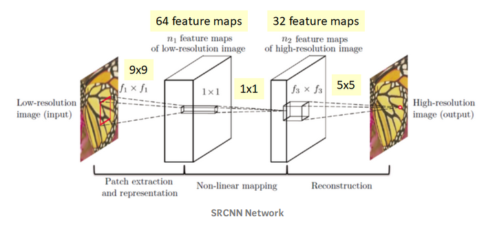

# SuperResolutionCNN

This repository is an implementation of the paper ["Image Super-Resolution Using Deep Convolutional Networks"](https://arxiv.org/pdf/1501.00092.pdf).

<center></center>

## Requirements

- PyTorch
- Numpy 
- OpenCV 2
- h5py 

## Training

As per the paper,the 91-image set is used for training. Set5 is used for evaluation.

Alternately, prepare.py can be used to create custom dataset.

```bash
python train.py --train-file "/91-image_x3.h5" \
                --eval-file "/Set5_x3.h5" \
                --outputs-dir "/outputs" \
                --scale 3 \
                --lr 1e-4 \
                --batch-size 16 \
                --num-epochs 400 \
                --num-workers 8 \
                --seed 123                
```

## Testing

The results are stored in the same path as the query image.

```bash
python test.py --weights-file "/srcnn_x3.pth" \
               --image-file "data/butterfly_GT.bmp" \
               --scale 3
```

## Results

We used the network settings for experiments, i.e., <a href="https://www.codecogs.com/eqnedit.php?latex={&space;f&space;}_{&space;1&space;}=9,{&space;f&space;}_{&space;2&space;}=5,{&space;f&space;}_{&space;3&space;}=5,{&space;n&space;}_{&space;1&space;}=64,{&space;n&space;}_{&space;2&space;}=32,{&space;n&space;}_{&space;3&space;}=1" target="_blank"></a>.

PSNR was calculated on the Y channel.After 50 epochs of training,below are the test results:


